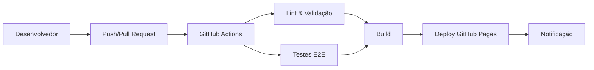

# MyCloset - Sistema de Atendimento ao Cliente

Uma aplicação web moderna e elegante para gerenciamento de atendimento ao cliente, com interface feminina e clean. Desenvolvida especificamente para lojas de roupas femininas, oferece uma experiência completa de atendimento multi-canal.

## 🚀 Funcionalidades

- **Filtros por Canal**: WhatsApp, E-mail, Instagram, Telegram
- **Filtros por Status**: Concluídas, Em Andamento
- **Chat em Tempo Real**: Interface de conversa integrada
- **Limite de Caracteres**: Campo de resposta com validação (255 caracteres)
- **Interface Responsiva**: Design adaptável para diferentes dispositivos

## 🛠️ Tecnologias Utilizadas

- **Frontend**: HTML5, CSS3, JavaScript (Vanilla)
- **Testes**: Cypress (E2E Testing)
- **CI/CD**: GitHub Actions
- **Deploy**: GitHub Pages
- **Relatórios**: Mochawesome Reporter

## 📋 Pré-requisitos

- Node.js (versão 18 ou superior)
- npm ou yarn
- Git

## 🔧 Instalação

1. **Clone o repositório**
   ```bash
   git clone https://github.com/Angelkel/MyCloset_Angel.git
   cd MyCloset_Angel
   ```

2. **Instale as dependências**
   ```bash
   npm install
   ```

3. **Execute a aplicação localmente**
   ```bash
   npm start
   ```
   A aplicação estará disponível em: `http://localhost:3000`

## 🧪 Testes

### Executar todos os testes
```bash
npm test
```

### Executar testes em modo interativo
```bash
npm run test:open
```

### Executar testes em modo headless
```bash
npm run test:headless
```

### Casos de Teste Implementados

1. **Filtro por Canal - WhatsApp**
2. **Filtro por Canal - E-mail**
3. **Filtro por Canal - Instagram**
4. **Filtro por Canal - Telegram**
5. **Filtro por Status - Concluídas**
6. **Filtro por Status - Em Andamento**
7. **Seleção de mensagem exibe chat**
8. **Validação de limite de caracteres (255)**
9. **Envio de mensagem no chat**

## 🔄 CI/CD Pipeline

O projeto utiliza GitHub Actions para automação completa do processo de desenvolvimento:

### Workflows Implementados

#### 1. **CI/CD Principal** (`.github/workflows/ci-cd.yml`)
- **Trigger**: Push para `main` ou `develop`, Pull Requests
- **Jobs**:
  - ✅ **Lint e Validação**: Verificação de código e segurança
  - 🧪 **Testes E2E**: Execução automática dos testes Cypress
  - 🔨 **Build**: Otimização e minificação de assets
  - 🚀 **Deploy**: Deploy automático para GitHub Pages
  - 📢 **Notificações**: Resumo do deploy e status

#### 2. **Pull Request Checks** (`.github/workflows/pr-checks.yml`)
- **Trigger**: Pull Requests para `main` ou `develop`
- **Funcionalidades**:
  - Validação de segurança
  - Execução de testes E2E
  - Comentários automáticos no PR
  - Upload de resultados de teste

#### 3. **GitHub Pages Deploy** (`.github/workflows/deploy-pages.yml`)
- **Trigger**: Push para `main`
- **Funcionalidades**:
  - Deploy otimizado para GitHub Pages
  - Configuração automática de ambiente
  - Controle de concorrência

### Fluxo de Desenvolvimento



### Status Badges

[](https://github.com/Angelkel/MyCloset_Angel/actions/workflows/ci-cd.yml)
[](https://github.com/Angelkel/MyCloset_Angel/actions/workflows/pr-checks.yml)
[](https://github.com/Angelkel/MyCloset_Angel/actions/workflows/deploy-pages.yml)

## 🌐 Deploy

A aplicação está disponível em: **https://angelkel.github.io/MyCloset_Angel/**

### Deploy Automático
- Qualquer push para a branch `main` dispara o deploy automático
- O deploy é feito para GitHub Pages
- Status do deploy é reportado nos Actions do GitHub

## 📊 Monitoramento

### Relatórios de Teste
- Relatórios HTML gerados automaticamente pelo Mochawesome
- Screenshots de falhas salvos automaticamente
- Vídeos de execução dos testes (quando habilitados)

### Métricas de Qualidade
- Auditoria de segurança automática
- Validação de HTML e CSS
- Cobertura de testes E2E

## 🚀 Como Contribuir

1. **Fork** o projeto
2. **Crie** uma branch para sua feature (`git checkout -b feature/AmazingFeature`)
3. **Commit** suas mudanças (`git commit -m 'Add some AmazingFeature'`)
4. **Push** para a branch (`git push origin feature/AmazingFeature`)
5. **Abra** um Pull Request

### Padrões de Commit
```
feat: nova funcionalidade
fix: correção de bug
docs: documentação
style: formatação de código
refactor: refatoração
test: testes
chore: tarefas de manutenção
```

## 📝 Scripts Disponíveis

| Comando | Descrição |
|---------|-----------|
| `npm start` | Inicia servidor local na porta 3000 |
| `npm run dev` | Inicia servidor com CORS habilitado |
| `npm test` | Executa todos os testes Cypress |
| `npm run test:open` | Abre Cypress em modo interativo |
| `npm run test:headless` | Executa testes em modo headless |
| `npm run validate` | Executa auditoria de segurança |
| `npm run build` | Executa processo de build |

## 🔒 Segurança

- Auditoria automática de dependências
- Validação de vulnerabilidades no pipeline
- Configuração segura de GitHub Actions
- Permissões mínimas necessárias

## 📞 Suporte

Para dúvidas ou sugestões:
- Abra uma [Issue](https://github.com/Angelkel/MyCloset_Angel/issues)
- Entre em contato através do repositório

## 📄 Licença

Este projeto está sob a licença ISC. Veja o arquivo [LICENSE](LICENSE) para mais detalhes.

---

**Desenvolvido com ❤️ para otimizar o atendimento ao cliente em lojas de roupas femininas** 